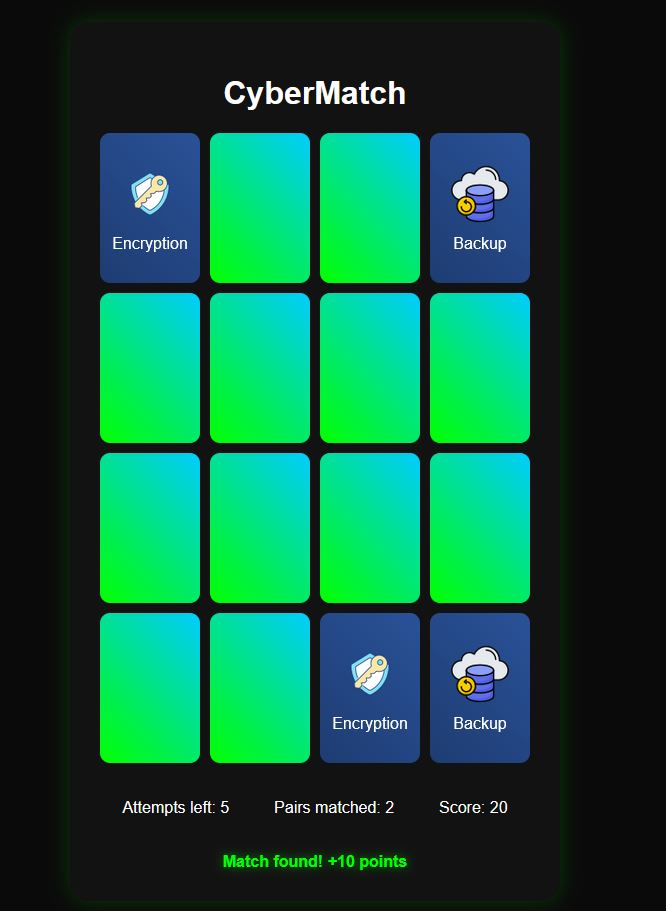

# CyberMatch

CyberMatch is an engaging and educational memory game that challenges players to match cybersecurity concepts while learning about digital safety. Built with HTML, CSS, and JavaScript, this project combines fun gameplay with important tech literacy.



## 🎮 Features

- 🔒 Match pairs of cybersecurity concepts like firewalls, encryption, and more
- 🧠 Improve memory skills through engaging gameplay
- 🖥️ Learn essential cybersecurity concepts in a fun, interactive way
- 🌐 Responsive design for both desktop and mobile play
- 🏆 Score tracking and limited attempts for competitive gameplay

## 📋 Table of Contents

- [Demo](#demo)
- [Installation](#installation)
- [How to Play](#how-to-play)
- [Technologies Used](#technologies-used)

## 🚀 Demo

You can play the game live at [https://dwain-barnes.github.io/cybermatch](https://dwain-barnes.github.io/CyberMatch)

## 💻 Installation

To run CyberMatch locally:

1. Clone this repository:
   ```
   git clone https://github.com/dwain-barnes/CyberMatch.git
   ```
2. Navigate to the project directory:
   ```
   cd cybermatch
   ```
3. Open `index.html` in your web browser.

No additional dependencies or build steps are required!

## 🕹️ How to Play

1. Click on any card to flip it and reveal the cybersecurity concept.
2. Click on a second card to try and find its match.
3. If the cards match, they stay face-up, and you earn points.
4. If they don't match, they flip back over.
5. Try to match all pairs before running out of attempts!
6. Learn about various cybersecurity concepts as you play.

## 🛠️ Technologies Used

- HTML5
- CSS3
- JavaScript
## Acknowledgments
- Cybersecurity icons created by icons8 from icons8.com
---
Happy matching and stay cyber-safe! 🔐🎉
